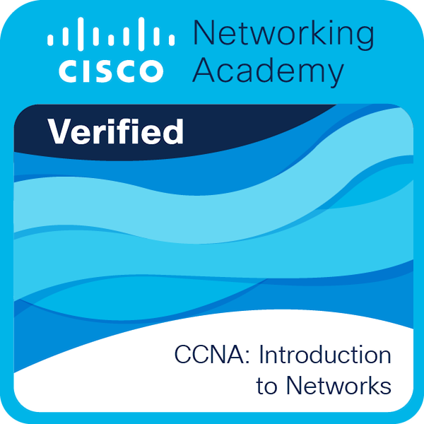
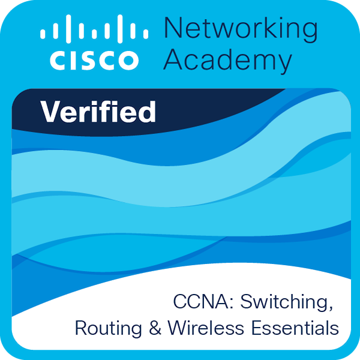
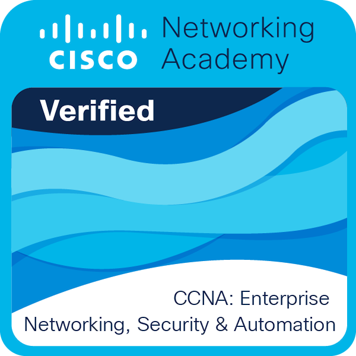

# Overview

This repository contains ``networking labs``, ``solved challenges`` and other useful resources for learning and practicing network engineering skills. 

You can find exercises on topics such as 
- routing protocols 
- subnetting 
- VPNs 
- firewalls and more. 

The solutions are provided in ``.pkt`` formats for ``Cisco  Packet Tracer`` as well as proper documentation of what is contained in the lab. Feel free to explore, clone or fork this repository and share your feedback.

# Badges

Here are any badges or certifications that I've earned that are related to Networking

&nbsp; &nbsp; &nbsp;
 &nbsp; &nbsp; &nbsp;
 &nbsp; &nbsp; &nbsp;